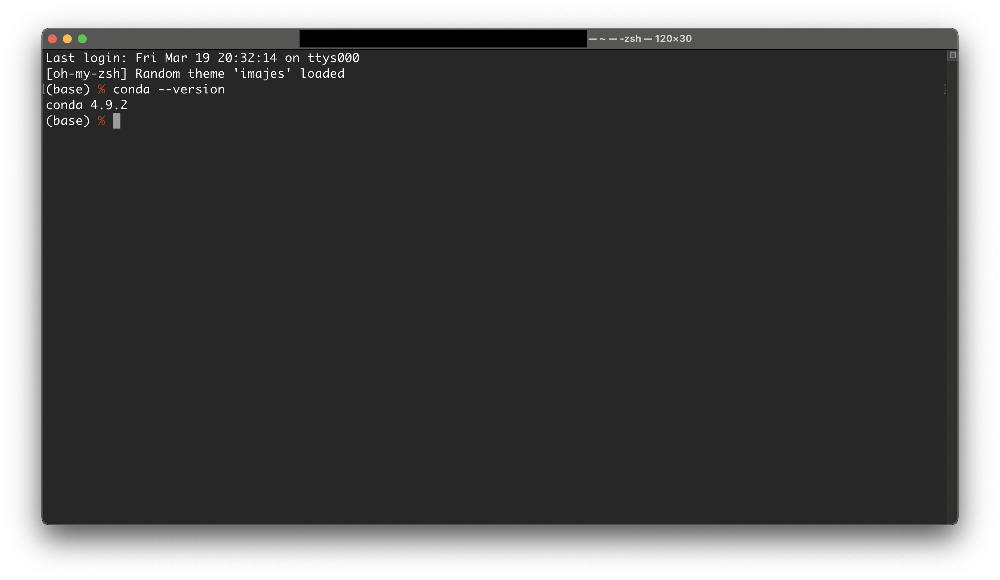
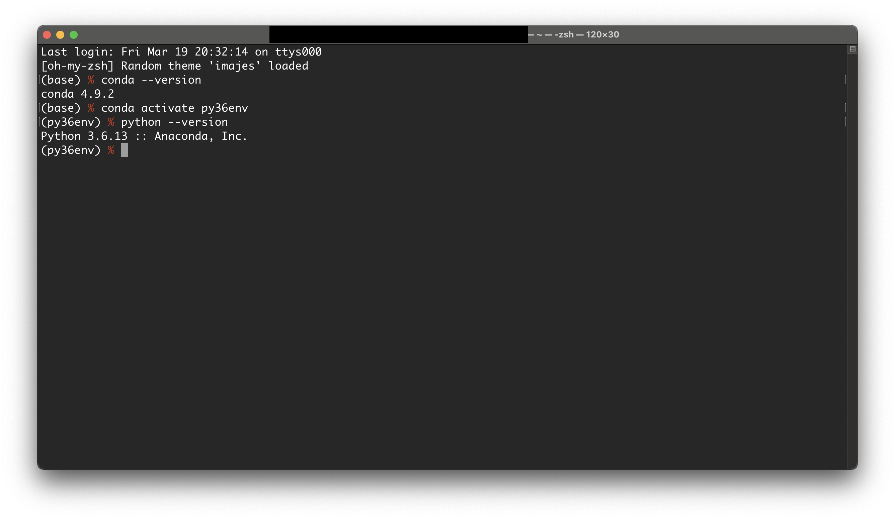
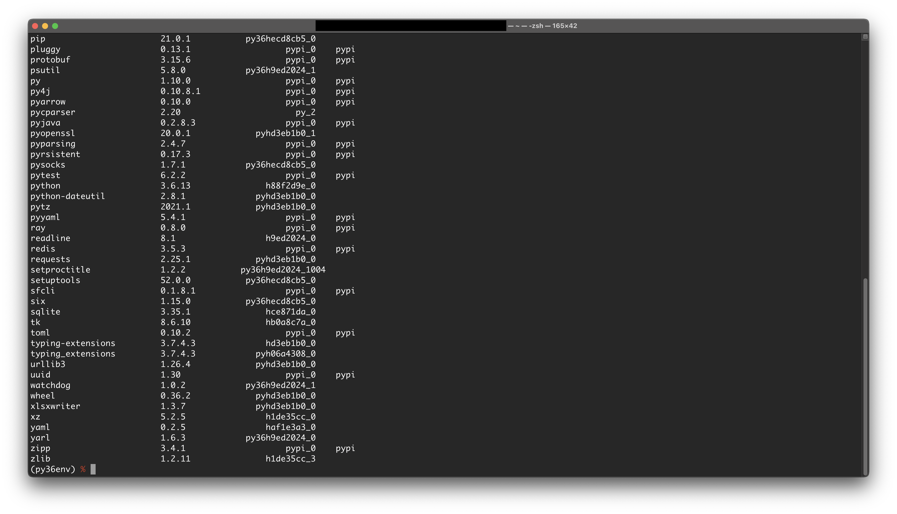
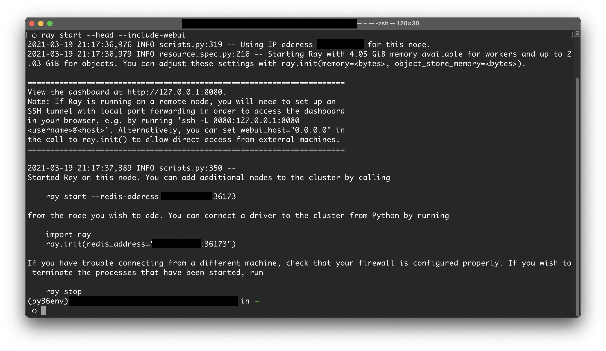
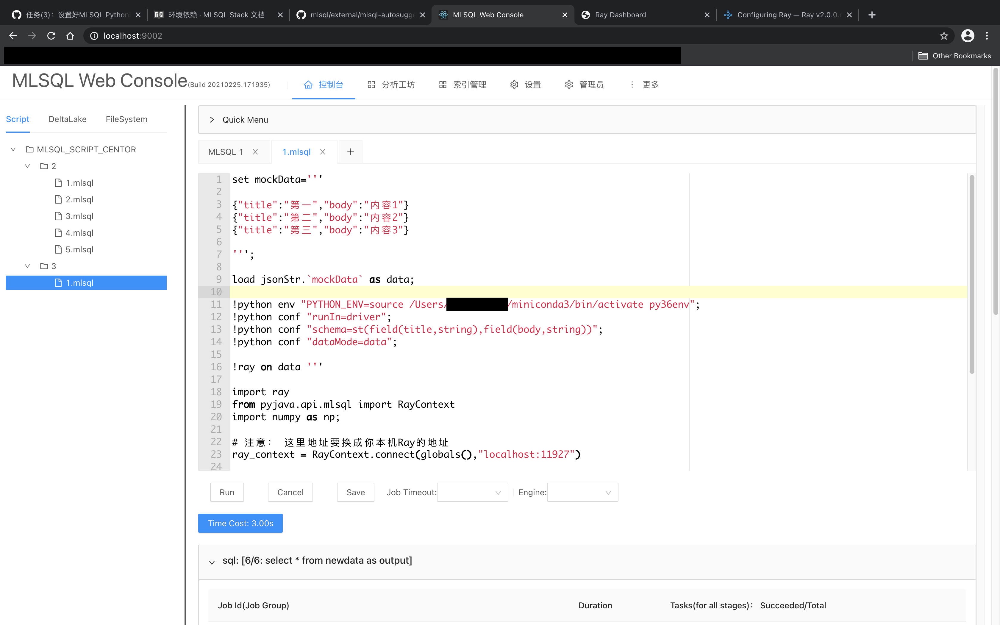
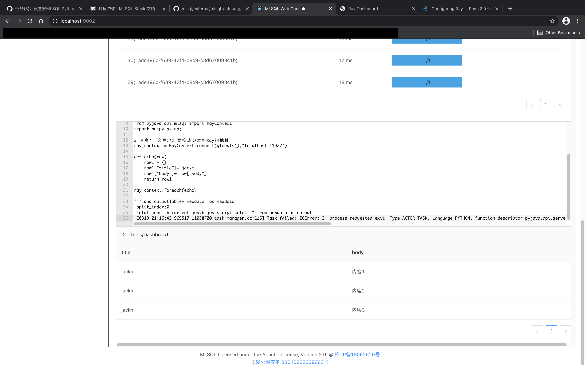

1. 从https://docs.conda.io/en/latest/miniconda.html下载miniconda3，并按照https://conda.io/projects/conda/en/latest/user-guide/install/macos.html中的说明顺利安装成功。
   

2. 执行命令创建3.6版本的python环境。

   ```
   conda create --name py36env python=3.6
   ```

   

3. 用conda和pip安装依赖。
   

4. 启动Ray。
   

5. 修改测试代码中的python环境配置和ray地址，尝试运行测试代码。
   
   

